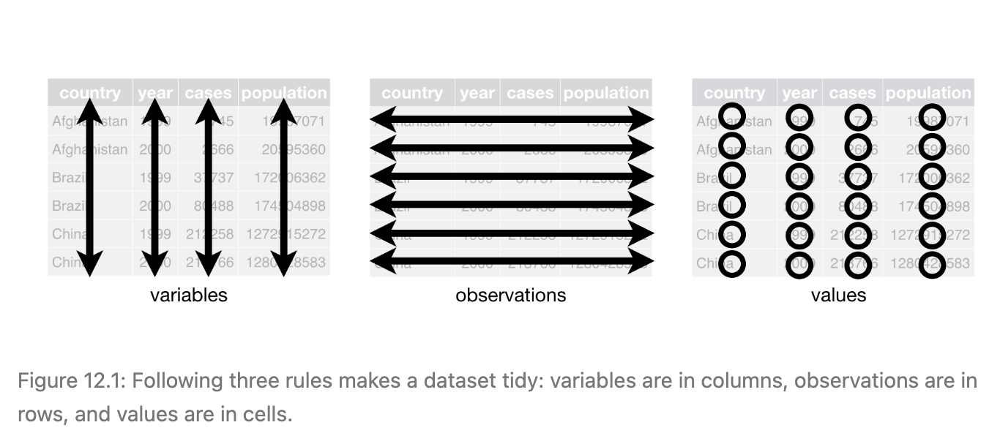

<style type="text/css">
  body{
  font-size: 14pt;
}
</style>

```{r installPackages, echo=FALSE, include=FALSE, message=FALSE}
# This just checks if students need to install some packages that they might 
# not have.
if (!require(nycflights13))
  install.packages("nycflights13", repos = "http://cran.us.r-project.org")
```

```{r setup, include=FALSE}
knitr::opts_chunk$set(echo = TRUE)
library(learnr)     # For interactive exercises
library(tidyverse)  # For ggplot2, dplyr, readr
library(nycflights13)
library(maps)
```

## Tidy Data

The three rules of tidy data:

  - Each variable must have its own column.
  - Each observation must have its own row.
  - Each value must have its own cell.

A visual representation of the rules from *R for Data Science*:

{width=100%}

**Format your tibbles according to these rules - tidyverse functions expect you to!**

Untidy datasets are unfortunately very common. Two common reasons why a dataset is untidy:

  - Variables are spread across multiple columns.
  - Observations are spread across multiple rows.
  
We deal with these problems by *pivoting* the dataset.

### Pivoting

#### `pivot_longer()`

Use `pivot_longer()` to deal with variables that are spread across multiple columns. In `grades_wide`, values of the year variable are column names, and grades appear in multiple columns.

```{r}
grades_wide <- tribble(
  ~name, ~sex, ~`2015`, ~`2016`, ~`2017`,
     'Wu',  'M', 83,      89,      93,
  'Alice',  'F', 92,      90,      93,
 'Jane',  'F', 80,      87,      99,
 'Gilberto','M', 67,      90,      92)
grades_wide
```

`pivot_longer()` fixes the tibble. `pivot_longer()` has four main arguments:

  - `data`: The tibble to pivot
  - `cols`: The columns to make longer (the others are ignored)
  - `names_to`: The name of the new variable the old column names (`cols`) should be put in
  - `values_to`: The name of the new variable the other spread out variable values should be put in

Each of the variables - `name`, `sex`, `year`, and `grade` - is now in its own column.

```{r}
grades_wide |>
  pivot_longer(cols = !c(name, sex), names_to = "year", values_to = "grade")
```

#### `pivot_wider()`

Use `pivot_wider()` to deal with observations that are spread across multiple rows. In `table2`, each observation, i.e., each country-year entry, is spread across two rows.

```{r}
table2
```

`pivot_wider()` fixes the tibble. `pivot_wider()` has three main arguments:

  - `data`: The tibble to pivot
  - `names_from`: The column from which the names of the new variables are extracted 
  - `values_from`: The column from which the values of the new variables are extracted

Each observation is now in its own row.

```{r}
table2 |> pivot_wider(names_from = type, values_from = count)
```

### Exercise 1

```{r tidy_ex_setup, include=FALSE}
library(learnr)
library(tidyverse)
mlb <- readr::read_csv("data/mlb.csv", show_col_types = FALSE)
```

`mlb` is a tibble with data on baseball players.

```{r, message=FALSE}
mlb <- read_csv("data/mlb.csv")
mlb |> glimpse()
```

#### (a)

Calculate the ratio of home runs to fly balls for each triple of division, team, and year. Your final tibble should have variables called `division`, `team`, `year` and `HR_FB_ratio`.

```{r tidy_a, exercise=TRUE, exercise.setup="tidy_ex_setup"}

```

```{r tidy_a-solution}
mlb |>
  group_by(division, team, year) |>
  summarize(HR_FB_ratio = sum(HR) / sum(FB)) |>
  ungroup()
```

#### (b)

Turn this into a wide dataset called `mlb_wide` with variables `division`, `team`, `2015`, `2016`, `2017`, and `2018`. The values of the year variables should be the ratios of home runs to fly balls.

```{r tidy_b_prep, include=FALSE}
library(tidyverse)
mlb <- readr::read_csv("data/mlb.csv", show_col_types = FALSE)
mlb_ratios <- mlb |>
  group_by(division, team, year) |>
  summarize(HR_FB_ratio = sum(HR) / sum(FB)) |>
  ungroup()
```

```{r tidy_b, exercise=TRUE, exercise.setup="tidy_b_prep"}

```

```{r tidy_b-solution}
mlb_wide <- mlb |>
  group_by(division, team, year) |>
  summarize(HR_FB_ratio = sum(HR) / sum(FB)) |>
  ungroup() |>
  pivot_wider(names_from = year, values_from = HR_FB_ratio)
```

#### (c)

Create a variable in `mlb_wide` called `increased` that indicates whether the ratio of home runs to fly balls was higher in 2018 than in 2015.

```{r tidy_c_prep, include=FALSE}
library(tidyverse)
mlb <- readr::read_csv("data/mlb.csv", show_col_types = FALSE)
mlb_wide <- mlb |>
  group_by(division, team, year) |>
  summarize(HR_FB_ratio = sum(HR) / sum(FB)) |>
  ungroup() |>
  pivot_wider(names_from = year, values_from = HR_FB_ratio)
```

```{r tidy_c, exercise=TRUE, exercise.setup="tidy_c_prep"}

```

```{r tidy_c-solution}
mlb_wide <- mutate(mlb_wide, increased = `2018` > `2015`)
```

#### (d)

For each year, calculate the correlation with the following year. That is, compute $\rho_{2015, 2016}$, $\rho_{2016, 2017}$, and $\rho_{2017, 2018}$.

(Hint: use `cor()` along with `summarize()`)

```{r tidy_d, exercise=TRUE, exercise.setup="tidy_c_prep"}

```

```{r tidy_d-solution}
summarize(
  mlb_wide,
  cor_15_16 = cor(`2015`, `2016`),
  cor_16_17 = cor(`2016`, `2017`),
  cor_17_18 = cor(`2017`, `2018`)
)
```

#### (e)

Turn `mlb_wide` into a long dataset called `mlb_long` and change the type of `year` to integer (if you don't do this, it will be character).

```{r tidy_e, exercise=TRUE, exercise.setup="tidy_c_prep"}

```

```{r tidy_e-solution}
mlb_long <- mlb_wide |> 
  pivot_longer(`2015`:`2018`, names_to = "year", values_to = "HR_FB_ratio") |>
  mutate(year = as.integer(year))
```

#### (f)

Using `mlb_long`, create a line plot of the ratio of home runs to fly balls versus `year`. Color by `team`, facet by `division`, and choose the linetype based on `increased`.

```{r tidy_f_prep, include=FALSE}
library(tidyverse)
mlb <- readr::read_csv("data/mlb.csv", show_col_types = FALSE)
mlb_wide <- mlb |>
  group_by(division, team, year) |>
  summarize(HR_FB_ratio = sum(HR) / sum(FB)) |>
  ungroup() |>
  pivot_wider(names_from = year, values_from = HR_FB_ratio) |>
  mutate(increased = `2018` > `2015`)
mlb_long <- mlb_wide |> 
  pivot_longer(`2015`:`2018`, names_to = "year", values_to = "HR_FB_ratio") |>
  mutate(year = as.integer(year))
```

```{r tidy_f, exercise=TRUE, exercise.setup="tidy_f_prep"}

```

```{r tidy_f-solution}
mlb_long |>
  ggplot(aes(x = year, y = HR_FB_ratio, color = team, linetype = increased)) +
  facet_wrap(vars(division), nrow = 3) +
  geom_line() +
  xlab("Year") +
  ylab("Ratio of Home Runs to Fly Balls") +
  theme_bw()
```

## Relational Data

Sometimes we have multiple levels of data. For example,

- Clinics with patients
- Countries, measured over years
- Pitchers with many pitches thrown

It may be inefficient to duplicate upper level information for every lower level observation.

Solution: **relate** two tidy tables

An example is the `nycflights13` data.

Tables:

- `airlines`: information on the carriers
- `airports`: information on airports
- `planes`: the planes flying between airports
- `weather`: weather conditions
- `flights`: flight information and connects the other tables

```{r}
airlines
```

```{r}
airports
```

```{r}
planes
```

```{r}
weather
```

```{r}
flights
```

### Keys

A **key** is one or more columns that uniquely identify an observation within the data set.

A **primary key** identifies entries within a table.

Single columns: `airports/faa`, `planes/tailnum`,  `airlines/carrier`

Multiple columns:

- `weather`: `year`, `month`, `day`, `hour` (could be a single date-time column), `origin` (location)
- `flights`: `year`, `month`, `day`, `hour`, `minute`, `flight`, `origin`, `dest`

A **foreign key** relates an observation in one table to observation in a second table.

- `flights`: `tailnum` uniquely identifies plane used
- `weather`: `origin` identifies airport

### Relations

When we connect two tables by keys, we have created a **relation**.  We classify relations by how many rows from the **left table** are connected to how many rows from the **right table**. A relation is a **table** with one row for each pair of connected keys.

* one-to-one: one row from the left is connected to one table from the right (this might be a subset of the rows from one or both tables)
* one-to-many: one row from left table is connected to one or more rows of the second table. Left table rows appear multiple times in the relation table.
* many-to-many: both left and right tables contribute multiple rows.

### Creating relations: Joins

From our book:

* **Mutating joins**: add new variables to one data frame from matching observations in another.
* **Filtering joins**: filter observations from one table based on whether or not they match an observation in the other table.

#### Types of joins

* **Left (outer) joins**: one or more rows for each row in left table
* **Right (outer) joins**: one or more rows for each in right table
* **Full (outer) joins**: at least one row for each row in both tables
* **Inner joins**: rows for each combination of matching keys in both tables

#### One-to-one join: carrier names

```{r}
fiveam <- filter(flights, year == 2013, month == 1, day == 1, hour == 5)
select(fiveam, flight, carrier)
```

```{r}
left_join(x = fiveam,
          y = airlines,
          by = "carrier") |> 
  select(flight, carrier, name) 
```

#### Multiple one-to-one

If we need to link more than two tables (or two tables more than one time), we build up several joins

```{r}
select(fiveam, flight, origin, dest)
```

```{r}
tmp <- left_join(fiveam, airports, by = c("origin" = "faa"))
select(tmp, flight, origin, name)
```

```{r}
left_join(tmp, airports, by = c("dest" = "faa")) |>
  select(flight, origin, dest, name.x, name.y)
```

- When the same column appears in both tables, it gets the `.x` (left) and `.y` (right) suffix
- Notice that this is a **left** join because BQN doesn't have a `name.y` entry.

Slightly cleaner example:

```{r}
left_join(fiveam, airports, by = c("origin" = "faa")) |>
  left_join(airports, by = c("dest" = "faa"), suffix = c("_origin", "_dest")) |>
  select(flight, name_origin, name_dest)
```

###  Exercise 2

#### (a)

Using the two tables `flights` and `planes` to make a new table `age_delay` that contains the tail number of a plane, the number of flying records of a plane in `flights`, the age of a plane and its average arrival delays.

**Hints:** *in table flights, you can use group_by() and summarise() to get the average arrival delay for each plane, and in table plane, variable year tells you the year manufactured. Data in table flights are in 2013.*

```{r join1, exercise=TRUE}

```

```{r join1-solution}
delay <- flights |>
  group_by(tailnum) |>
  summarize(avg_delay = mean(arr_delay, na.rm=TRUE), n = n()) 
age <- planes |> mutate(age = 2013 - year) |> select(tailnum, age)
age_delay <- left_join(age, delay, by="tailnum") 
```

#### (b)

Consider the planes with less than 50 flying records, and are less than 30 years old. Is there a relationship between the age of a plane and its delays? Draw a scatter plot and a smooth line to answer this question.

```{r join1-sol-setup, eval=TRUE, echo=FALSE}
delay <- group_by(flights, tailnum) |> summarise(avg_delay = mean(arr_delay, na.rm=TRUE), n = n()) 
age <- mutate(planes, age = 2013 - year) |> select(tailnum, age)
age_delay <- left_join(age, delay, by="tailnum") 
```

```{r join2, exercise=TRUE, exercise.setup="join1-sol-setup"}

```

```{r join2-solution}
age_delay |> filter(n > 50, age < 30) |> 
  ggplot(aes(x = age, y = avg_delay))+
  geom_point()+
  geom_smooth()
```

### Filtering Joins

A few times we used the fact that **outer joins** will result in tables with missing entries in order to count some feature.

This pattern is common enough to generate two **filtering join** functions:

- `semi_join(x, y)` keeps all observations in x that have a match in y.
- `anti_join(x, y)` drops all observations in x that have a match in y.

Big difference from mutating joins is that `y`'s columns are not included.

#### Semi-join

`semi_join(x, y)` keeps all the observations in `x` that are also in `y`.

{width=90%}

#### Anti-join

The opposite of a semi-join is an anti-join: keeps all the observations in `x` that are not in `y`.

{width=90%}


#### Example

Suppose we want to find the top 10 destinations by number of flights:

```{r}
top_dest <- flights |>
  count(dest, sort = TRUE) |>
  head(10)
top_dest
```

If we *join* to the `top_dest` table, we can get flights to those destinations:

```{r}
left_join(flights, top_dest) |> # natural join on `dest` column
  select(flight, dest, n) -> flights_to_tops
flights_to_tops
```

Then filtering out the NAs:

```{r}
filter(flights_to_tops, !is.na(n))
```

Do it in one step with `semi_join`:

```{r}
semi_join(flights, top_dest) |>
  select(flight, dest)
```

### Exercise 3

#### (a)

Filter flights to only show flights with planes that have flown at least 100 flights.

```{r semijoin, exercise=TRUE}

```

```{r semijoin-hint}
##You can use function count() to count the unique vlues of one or more variables.
?count
```

```{r semijoin-solution}
planes_many <- flights |> 
  count(tailnum, sort=TRUE) |> 
  filter(n > 100)

semi_join(flights, planes_many)
```

#### (b)

Check the variable `carrier` in `flights`, what do the tail numbers that don’t have a matching record in planes have in common? Show the number of tailnumbers that don’t have a matching record in planes for each carrier.

```{r antijoin, exercise=TRUE}

```

```{r antijoin-hint}
flights |> anti_join(...) 
## You can use function count()
```

```{r antijoin-solution}
flights |> 
  anti_join(planes, by="tailnum") |> 
  count(carrier, sort = TRUE)
```

#### (c)

Compute the average arrival delay by destination, then join on the airports data frame so you can show the spatial distribution of arrival delays. Visualize the delays on a map of the United States.

**Hints**: *You can use semi-join() to filter the flights that have 
destinations in the table airports, and then calculate the average arrival delays for each destination. Also, see the hint in the chunk for map-making code.*

```{r delaymap, exercise=TRUE}

```

```{r delaymap-hint}
## An easy way to draw a map of the United States:
ggplot(..., aes(lon, lat)) +
  borders("state") +
  coord_quickmap() + ...
```

```{r delaymap-solution}
flights |> 
  semi_join(airports, c("dest" = "faa")) |>
  group_by(dest) |> 
  summarise(delay = mean(arr_delay, na.rm=TRUE)) |> 
  left_join(airports, by = c("dest"="faa")) |> 
  ggplot(aes(lon, lat)) +
  borders("state") +
  geom_point(aes(colour = delay)) +
  coord_quickmap()+
  scale_color_gradient2(low = "blue", high = "red")
```